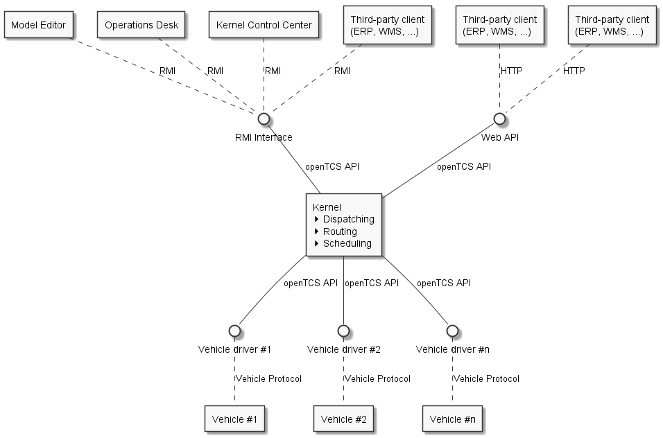
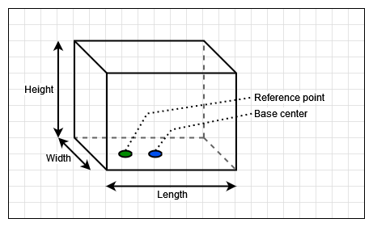
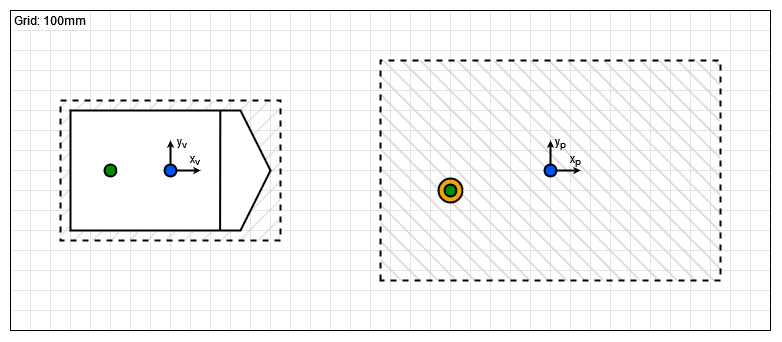
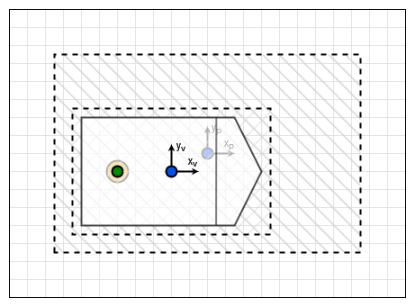
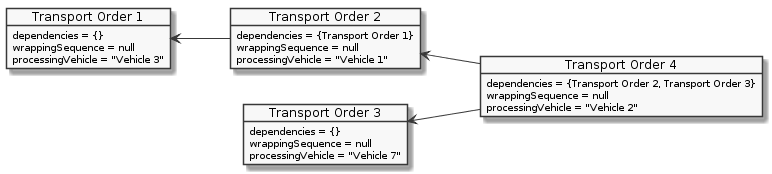
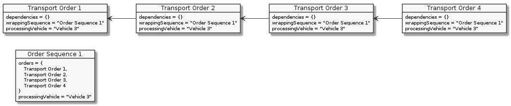

## 参考

### 支持的导航原理/车辆类型

openTCS 独立于特定的导航实现，因此可以使用任何类型的导航原理。
定位和导航通常是车辆端执行的任务：
车辆只需向控制系统报告其当前状态——包括其位置——然后控制系统命令车辆移动到不同的位置。

请注意，openTCS 专注于为运输单调度车辆。
此任务不应与较低层级的车辆端任务（如加速、减速和转向）混淆，后者不在 openTCS 的范围内。
因此，openTCS 的使用并不局限于特定类型的车辆。

### 最大车队规模

软件的设计并未对单个 openTCS 实例可管理的车辆数量施加特定限制。
然而，所使用的硬件设备/运行环境（CPU、RAM、通信带宽等）可能会限制系统的有效性能。

### 车辆要求

要使车辆能够被 openTCS 管理，它需要满足某些最低要求：

1. 必须能够与车辆进行通信。
   （这意味着必须指定并可以访问车辆的通信接口。）
   通信的具体实现方式并不重要，只要存在通信硬件并且有一种方法让 openTCS 利用该通信通道即可。
   在许多情况下，使用标准的 Wi-Fi 硬件。
2. 车辆必须能够报告其当前位置/状态。
3. 车辆必须能够执行从其当前位置到 openTCS 给定的行驶路径/环境中附近位置的移动指令。

### 系统要求

openTCS 没有任何特定的硬件要求。
CPU 性能和 RAM 容量高度依赖于用例，例如行驶路径的大小和复杂性以及管理的车辆数量。
需要某种类型的网络硬件——在大多数情况下，仅仅是标准以太网控制器——用于与车辆（以及可能的其他系统，如仓库管理系统）进行通信。

要运行 openTCS，需要 Java 运行时环境 (JRE) 版本 21。
（已安装 JRE 的 `bin` 目录，例如 `C:\Program Files\Eclipse Adoptium\jdk-21.0.3.9-hotspot\bin`，应包含在环境变量 PATH 中，以便使用其中包含的启动脚本。）

重要提示：由于 openTCS 使用的某个软件库（即：Docking Frames）的限制，某些 JRE 目前与 openTCS 不兼容。
Oracle 提供的 JRE 就是其中之一。
建议使用的 JRE 是由 https://adoptium.net/[Adoptium 项目] 提供的。

### 系统组件和结构

openTCS 由以下作为单独进程运行并在客户端-服务器架构中协同工作的组件组成：

- 内核（服务器进程），运行车辆独立的策略和控制车辆的驱动程序
- 客户端
  - 用于建模工厂模型的模型编辑器
  - 用于在工厂运行期间可视化工厂模型的操作台
  - 内核控制中心，用于控制和监控内核，例如提供车辆及其关联驱动程序的详细视图
  - 用于与其他系统通信的任意客户端，例如用于过程控制或仓库管理

.openTCS 系统概览

openTCS 内核的目的是提供运输系统/工厂的抽象驾驶模型，管理运输单并为车辆计算路线。
客户端可以与该服务器进程通信，以修改工厂模型、可视化行驶路径和运输单的处理过程，以及创建新的运输单。

内核中的三个主要策略模块负责处理运输单：

- 调度器决定哪个运输单应由哪辆车处理。
  此外，它还需要决定在某些情况下车辆应该做什么，例如当没有运输单时或当车辆电量低时。
- 路由器为车辆找到到达目的地的最佳路线。
- 调度器管理交通管理的资源分配，即避免车辆相互碰撞。

openTCS 发行版为每种策略提供了默认实现。
这些实现可以由开发人员轻松替换，以适应特定环境的要求。

作为 openTCS 内核一部分的驱动程序框架管理通信通道并将车辆驱动程序与车辆关联起来。
车辆驱动程序是内核与车辆之间的适配器，将每种车辆特定的通信协议转换为内核的内部通信方案，反之亦然。
此外，驱动程序可以通过内核控制中心客户端向用户提供低级功能，例如手动向关联的车辆发送电报。
通过使用合适的车辆驱动程序，单个 openTCS 实例可以同时管理不同类型的车辆。

作为 openTCS 发行版一部分的模型编辑器客户端允许编辑工厂模型，这些模型可以加载到内核中。
这包括定义换载站、行驶轨道和车辆等。

作为 openTCS 发行版一部分的操作台客户端用于显示运输系统的总体状态和任何活跃的运输过程，并交互式地创建新的运输单。

作为 openTCS 发行版一部分的内核控制中心客户端允许控制和监控内核。
其中包括将车辆驱动程序分配给车辆并通过启用通信来控制它们，以及通过显示车辆状态信息等方式监控它们。

可以实现并附加其他客户端，例如用于控制更高层级的工厂流程。
对于 Java 客户端，openTCS 内核提供了一个基于 Java RMI（远程方法调用）的接口。
此外，openTCS 提供了一个 Web API，用于创建和撤回运输单以及检索运输单状态更新。=== 工厂模型元素

在 openTCS 中，工厂模型由以下一组元素组成。
这些元素中与工厂模型相关的属性（例如点位的坐标或路径的长度）可以使用模型编辑器客户端进行编辑。

#### 点位

点位是驾驶路线中离散车辆位置逻辑映射。
在工厂运行模式下，车辆被排序（从而移动）从模型中的一个点位到另一个点位。
一个点位具有以下属性：

- 一个 _类型_，可以是以下之一：
  - _停车位置_：
   表示车辆在处理指令期间可以暂时停止的位置，例如执行操作。
   当车辆到达此类位置时，预期它会报告进入。
   不过，它在此处停留的时间不应超过必要时间。
   使用模型编辑器客户端建模时，停车位置是点位的默认类型。
  - _泊车位置_：
   表示车辆在未处理指令时可以长时间停止的位置。
   当车辆到达此类位置时，也预期它会报告进入。
- 一个 _位置_，即点位在工厂坐标系中的坐标。
- 一个 _车辆朝向角_，表示车辆占据该点位时的假设/预期朝向。
- 一组 _车辆包络线_，描述位于该点位的车辆所占用的区域。
- 一个 _最大车辆边界框_，描述位于该点位的车辆可能具有的最大边界框（有关更多信息，请参阅 边界框）。

NOTE：在 openTCS 中，0 度角位于 3 点钟位置，正值表示逆时针旋转。

===== 边界框

.openTCS 中的边界框

边界框的特征是一个参考点，默认情况下该参考点位于边界框底部（即高度为 0）的中心，本节其余部分将其称为 _底边中心_。
边界框的长度和宽度相对于底边中心是对称的，高度是从边界框的底部测量的。

可选地，参考点偏移量描述了参考点相对于底边中心的位置。
参考点的坐标指的是一个坐标系，其原点位于底边中心，其轴沿边界框的纵向和横向轴运行——即 x 轴沿边界框的长度运行，y 轴沿边界框的宽度运行。

对于车辆，边界框的方向使其纵轴与车辆的纵轴平行。
对于参考点偏移量，正的 x 值表示向车辆前进方向的偏移，正的 y 值表示向左侧的偏移。
例如，车辆的物理参考点——即其报告的坐标所指的点——与其边界框的参考点很可能始终对齐。

对于点位，边界框的方向根据点位的朝向角确定，以便边界框的纵轴与位于该点位的车辆的纵轴平行。
对于参考点偏移量，正的 x 值表示向车辆前进方向的偏移，正的 y 值表示向左侧的偏移。

下图显示了车辆（左侧）和点位（右侧）的边界框示例。
（虽然 openTCS 中的边界框是三维的，但此处显示的示例边界框仅为二维，以便于理解可视化。）

.车辆和点位的边界框

在这两种情况下，蓝点代表各自边界框的底边中心，绿点代表它们的参考点。
虚线代表各自边界框的周长。
在右侧，橙点代表实际的工厂模型点位。
在上述示例中，边界框具有以下属性：

[cols="1,1,1,1,1,1", options="header"]

_|省略_

_|省略_

作为额外的示例，下图显示了边界框之间的关系，以及如果车辆位于该点位上会是什么样子。
（请注意，两个边界框的参考点是齐平的。）

.车辆和点位边界框的关系

在此示例中，点位的边界框完全包围了车辆的边界框。
然而，在某些情况下可能并非如此，车辆的边界框可能会超出点位边界框的一边或多边。
为了防止在这种情况下将车辆发送到该点位，路由器提供了一个专用的成本函数——请参阅 默认路由器。

#### 路径

路径是车辆可导航的点之间的连接。
除了源点和目标点之外，路径的主要属性包括：

- 它的 _长度_，这对于工厂运行模式下的车辆可能是相关信息。
  根据路由器配置，它也可用于计算路由成本/寻找到达目标点的最优路径。
- 一个 _最大速度_ 和 _最大倒车速度_，这对于工厂运行模式下的车辆可能是相关信息。
  根据路由器配置，它也可用于计算路由成本/寻找到达目标点的最优路径。
- 一个 _锁定_ 标志，当设置时，告诉路由器在计算车辆的路由时不得使用此路径。
- 一系列 _外设任务_，描述当车辆穿越路径时由外设设备（按给定顺序）执行的操作。
- 一组 _车辆包络线_，描述穿越路径的车辆所占用的区域。

===== 外设任务

外设任务的属性包括：

- 对 _位置_ 的引用，该位置代表执行该操作的外设设备——请参阅 位置。
- 外设设备要执行的 _实际_ 操作。
- 一个 _执行触发器_，定义执行操作的时机。
  支持的值为：
  ** `AFTER_ALLOCATION`：应在车辆 _已分配_ 路径后触发操作的执行。
  ** `AFTER_MOVEMENT`：应在车辆 _已穿越_ 路径后触发操作的执行。
- 一个 _完成必需_ 标志，当设置时，要求操作完成以允许车辆继续行驶。
  此标志与执行触发器配合工作。
  使用 `AFTER_ALLOCATION` 执行触发器并将完成必需标志设置为 `true` 时，车辆必须在路径的源点等待，直到操作完成。
  使用 `AFTER_MOVEMENT` 执行触发器并将完成必需标志设置为 `true` 时，车辆必须在路径的目标点等待，直到操作完成。

#### 位置

位置是标记车辆可以执行特殊操作（如装载或卸载货物、充电等）的点位的标记。
位置的属性包括：

- 它的 _类型_，基本上定义了允许在该位置执行哪些操作——请参阅 位置类型。
- 一组指向 _链接_ 到点位的链接，从这些点位可以到达该位置。
  为了在工厂模型中对车辆有用，位置需要至少链接到一个点位。
- 一个 _锁定_ 标志，当设置时，告诉调度程序可能需要在该位置执行操作的运输单不得分配给车辆。

此外，位置还可以映射外设设备，以便与其通信并允许车辆与之交互（例如，沿路径打开/关闭防火门）。
有关如何添加和配置外设设备的详细信息，请参阅 添加和配置外设设备。

#### 位置类型

位置类型是抽象元素，用于对位置进行分组。
位置类型只有两个相关属性：

- 一组 _允许的/支持的车辆操作_，定义车辆可以在该类型的位置执行哪些操作。
- 一组 _允许的/支持的外设任务_，定义映射到该类型位置的外设设备可以执行哪些操作。

#### 车辆

车辆映射物理车辆，以便与其通信并可视化其位置和其他特征。
车辆提供以下属性：

- 一组能量等级阈值，其组成如下：
  - 一个 _临界能量等级_，这是低于该等级时车辆能量被视为临界的阈值。
   在工厂运行期间，此值可用于决定何时必须为车辆的能量存储充电。
  - 一个 _良好能量等级_，这是高于该等级时车辆能量被视为良好的阈值。
   在工厂运行期间，此值可用于决定何时无需为车辆的能量存储充电。
   配置此值时，它必须大于或等于 _临界能量等级_。
  - 一个 _充分充电能量等级_，这是高于该等级时车辆被视为已充分充电的阈值。
   在工厂运行期间，此值可用于决定何时车辆可以停止充电。
  - 一个 _充满电能量等级_，这是高于该等级时车辆被视为已充满电的阈值。
   在工厂运行期间，此值可用于决定何时车辆应停止充电。
   配置此值时，它必须大于或等于 _充分充电能量等级_。
- 一个 _最大速度_ 和 _最大倒车速度_。
  根据路由器配置，它可用于计算路由成本/寻找到达目标点的最优路径。
- 一个 _集成级别_，指示车辆当前允许集成到系统中的程度。
  车辆的集成级别只能使用操作台客户端进行调整，而不能使用模型编辑器客户端进行调整。
  车辆可以是
  ** ..._忽略_：
     车辆及其报告的位置将被完全忽略，因此车辆不会显示在操作台中。
     该车辆不可用于运输单。
  ** ..._注意_：
     车辆将显示在其报告的位置的操作台中，但系统不会为该位置分配任何资源。
     该车辆不可用于运输单。
  ** ..._尊重_：
     将为车辆报告的位置分配资源。
     该车辆不可用于运输单。
  ** ..._利用_：
     该车辆可用于运输单，并将被 openTCS 利用。
- 一个 _暂停_ 标志，指示车辆当前是否处于暂停状态。
  暂停的车辆预计不会移动/操作。
  如果在设置其暂停标志时它正在移动，则预期它将尽快停止。
  某些车辆类型可能不支持在到达其移动命令的目标之前停止。
  在这种情况下，只要车辆处于暂停状态，openTCS 仍将确保不向车辆发送进一步的移动命令。
- 一组 _可接受的运输单类型_，每种类型由名称和优先级组成，用于在将运输单分配给车辆时过滤运输单（按其类型）并对它们进行排序（按其优先级）。
  对于车辆的可接受运输单类型，较低的值表示较高的优先级。
  另请参阅 运输单。
- 一个 _路由颜色_，这是用于可视化车辆前往目的地所采取的路径的颜色。
- 一个 _包络线键_，指示应考虑哪些包络线（在点位和路径中定义）用于该车辆。
- 一个 _边界框_，描述车辆的物理尺寸（有关更多信息，请参阅 边界框）。

#### 区块

区块（或区块区域）是可能适用特殊交通规则的区域。
它们可用于防止死锁情况，例如在路径交叉点或死胡同处。
区块有两个相关属性：

- 一组 _成员_，即区块由之组成的资源（点位、路径和/或位置）。
- 一个 _类型_，决定了进入区块的规则：
  - _仅限单车_：
   聚合在此区块中的资源同一时间只能被一辆车辆使用。
   使用模型编辑器客户端建模时，这是区块的默认类型。
  - _仅限同向_：
   聚合在此区块中的资源可以被多辆车辆同时使用，但前提是它们以相同的方向穿越区块。

NOTE：车辆穿越区块的方向是使用包含属于区块资源的第一个分配请求确定的——请参阅 默认调度器。
对于请求的资源（通常是点位和路径），检查路径是否具有键为 `tcs:blockEntryDirection` 的属性。
该属性的值可以是任意字符串（包括空字符串）。
如果没有这样的属性，则使用路径的名称作为方向。

#### 图层

图层是抽象元素，用于对点位、路径、位置和链接进行分组。
它们可用于对复杂工厂进行建模，并将工厂部分划分为逻辑组（例如多层工厂中的楼层）。
图层具有以下属性：

- 一个 _激活_ 标志，指示图层当前是否设置为活动（绘制）图层。
  一次只能有一个活动图层。
  此属性仅在模型编辑器客户端中显示。
- 一个 _可见_ 标志，指示图层是显示还是隐藏。
  当图层隐藏时，它包含的模型元素不会显示。
- 一个描述性 _名称_。
- 一个 _组_，图层被分配到的组——请参阅 图层组。
  图层一次只能分配到一个图层组。
- 一个 _组可见_ 标志，指示图层所属的图层组是显示还是隐藏——请参阅 图层组。

除了上述属性外，图层还有一个序数号（不显示），它定义了图层之间的相对顺序。
图层的顺序由“模型编辑器”和“操作台”客户端中“图层”表中的条目顺序表示。
最上面的条目对应于最顶层（显示在所有其他图层之上），最下面的条目对应于最底层（显示在所有其他图层之下）。

#### 图层组

图层组是抽象元素，用于对图层进行分组。
图层组具有以下属性：

- 一个描述性 _名称_。
- 一个 _可见_ 标志，指示图层组是显示还是隐藏。
  当图层组隐藏时，分配给它的所有图层中包含的模型元素都不会显示。
  图层组的可见状态不影响分配给它的图层的可见状态。=== 工厂运行元素

运输单和订单序列是仅在工厂运行时可用的元素。
它们的属性主要在创建相应元素时设置。

#### 运输单

运输单是由车辆处理的参数化移动和操作序列。
创建运输单时，可以设置以下属性：

- 处理车辆必须按给定顺序处理的_目的地_序列。
  每个目的地由车辆必须前往的位置以及在该位置必须执行的操作组成。
- 可选的_截止时间_，指示运输单应被处理完成的时间。
- 可选的_类型_，这是一个用于过滤可能被分配给该运输单的车辆的字符串。
  只有当运输单的类型在车辆的可接受订单类型集合中时，车辆才能被分配给该运输单。
  （可能有用的类型示例包括 `"Transport"` 和 `"Maintenance"`。）
- 可选的_预期车辆_，指示调度程序将运输单分配给指定车辆，而不是自动选择一辆。
- _可丢弃_标志，指示运输单是否可以自动撤回，主要是为了使处理车辆可用于另一个运输单。
  通常标记为可丢弃的订单是停车订单，例如：
  当车辆正在前往停车位途中且一个新的运输单对该车辆可用时，尽早将该新运输单分配给车辆是有意义的，从而跳过前往停车位的剩余路程。
- 可选的_依赖关系_集合，即对其他需要在当前运输单之前处理的运输单的引用。
  依赖关系具有传递性，这意味着如果订单 A 依赖于订单 B，且订单 B 依赖于订单 C，则必须先处理 C，然后处理 B，最后处理 A。
  因此，依赖关系是一种对一组运输单施加顺序的手段。
  （然而，它们并不隐含要求所有运输单都由同一辆车处理。
  这可以通过同时设置运输单的_预期车辆_属性来可选地实现。）
  下图显示了多个运输单之间依赖关系的示例：

.运输单依赖关系

===== 运输单优先级

在 openTCS 中，运输单没有优先级属性。
这是因为运输单的优先级可能会随时间变化或在添加其他运输单时发生变化。

最终，单个运输单的有效优先级取决于所使用的调度程序实现。
在 openTCS 的默认调度程序中，运输单的__截止时间__属性旨在用于优先级排序——截止时间越早，订单的有效优先级越高。
要从一开始就赋予运输单更高的优先级，您可以将其截止时间设置为早于所有其他订单的截止时间，例如设置为“现在”或过去的一个时间点。

#### 订单序列

注意：操作台应用程序目前不提供创建订单序列的方法。
它们只能通过专用客户端以编程方式创建，这些客户端不属于 openTCS 发行版的一部分。

订单序列描述了一个跨越多个运输单的过程，这些运输单必须由单一车辆按照序列定义的精确顺序依次执行。
一旦车辆被分配到订单序列，在该序列完成之前，它不得处理不属于该序列的运输单。

当由同一辆车执行的复杂过程无法映射到单个运输单时，订单序列非常有用。
例如，当过程中某些步骤的详细信息只有在处理完前面的步骤后才已知时，就会发生这种情况。

订单序列具有以下属性：

- _运输单_序列，只要未设置完成标志（见下文），就可以扩展。
- _完成_标志，指示不会再向序列中添加任何运输单。
  此标志不可重置。
- _故障致命_标志，指示如果序列中的一个运输单失败，除非失败的运输单被标记为可丢弃，否则其后的所有订单应立即被视为失败。
- _已完成_标志，指示订单序列已被处理（且车辆不再绑定到它）。
  只有先标记为完成的订单序列才能标记为已完成。
- _订单类型_集合 —— 参见 运输单。
  只有类型包含在订单序列的订单类型集合中的运输单才能被添加到其中。
- 可选的_预期车辆_，指示调度程序将订单序列分配给指定车辆，而不是自动选择一辆。
  如果设置了此属性，则添加到订单序列中的所有运输单必须携带相同的预期车辆值。

.一个订单序列

#### 外设任务

外设任务描述了由外设设备执行的操作。
外设任务具有以下属性：

- 由外设设备执行的_操作_ —— 参见 外设操作。
- _保留令牌_，可用于保留外设设备。
  为特定令牌保留的外设设备只能处理与该保留令牌匹配的任务 —— 参见 保留令牌。
- 可选的_相关车辆_，引用创建该外设任务的车辆。
- 可选的_相关运输单_，引用创建该外设任务的上下文中的运输单。=== 公共元素属性

#### 唯一名称

每个工厂模型和工厂操作元素都有一个唯一的名称，用于在系统中识别它，无论其元素类型是什么。
两个元素不得被赋予相同的名称，即使例如一个是点位而另一个是运输单。

#### 通用属性

除了列出的属性外，还可以为所有行驶路线元素定义任意属性，以键值对的形式存在，例如可以被车辆驱动程序或客户端软件读取和评估。
键和值都可以是任意字符字符串。
例如，可以在模型中为车辆定义一个键值对 `"IP 地址"`:``"192.168.23.42"``，指明用于与车辆通信的 IP 地址；车辆驱动程序现在可以在运行时检查是否为键 `"IP 地址"` 定义了值，如果是，则使用它自动配置到车辆的通信通道。
这些通用属性的另一种用途是在模型中的某些路径上执行特定于车辆的操作。
如果车辆应该在当前位于某条路径时发出声音警告和/或打开右侧转向灯，可以为该路径定义键为 `"声音警告"` 和/或 `"右侧转向灯"` 的属性，并由相应的车辆驱动程序进行评估。

### 默认策略

openTCS 为每个策略模块提供了默认实现。
这些实现可以轻松替换以适应项目特定的要求。
（参见开发者指南。）

#### 默认调度器

当运输单或车辆可用时，调度器需要决定哪些运输单应如何处理，以及哪辆车应该做什么。
为了做出这个决定，默认调度器采取以下步骤：

1. 准备新的运输单进行处理。
  这包括检查一般可路由性和未完成的依赖关系。
1. 执行当前活跃进程的更新。
  这包括：
  - 运输单的撤回
  - 运输单的成功完成
  - 为处理订单序列的车辆分配后续运输单
1. 尽可能将当前空闲的车辆分配给可处理的运输单。
  - 考虑车辆的准则包括：
*** 它必须位于行驶路线中的已知位置。
*** 它不得被分配给运输单，或者分配的运输单必须是 _可放弃的_。
    例如，停车订单就是这种情况，或者如果车辆的能量水平不危急，充电订单也是这种情况。
*** 它不得处理订单序列；或者，当前处理的运输单必须是 _可放弃的_，并且必须是标记为 _完整_ 的订单序列中的最后一个订单。
*** 其能量水平不得危急。
    （能量水平危急的车辆仅在与第一个目的地操作是充电操作的运输单一起考虑时被纳入考虑。）
  - 考虑运输单的准则包括：
*** 它必须总体上可调度。
*** 它不得属于已由车辆处理的订单序列的一部分。
  - 分配机制如下：
*** 如果空闲车辆少于可处理的运输单，则根据可配置的准则对车辆列表进行排序。
    然后默认调度器遍历排序后的列表，并为每辆车找到所有可由其处理的订单，计算所需的路径，根据可配置的准则对候选项进行排序并分配第一个。
*** 如果可处理的运输单少于空闲车辆，则根据可配置的准则对运输单列表进行排序。
    然后默认调度器遍历排序后的列表，并为每个运输单找到所有可以处理它的车辆，计算所需的路径，根据可配置的准则对候选项进行排序并分配第一个。
*** 有关排序准则的配置选项，请参阅 默认调度器配置条目。
1. 尽可能将仍然空闲的车辆发送到充电位置。
  - 考虑车辆的准则包括：
*** 它必须位于行驶路线中的已知位置。
*** 其能量水平处于 _降级_ 状态。
1. 尽可能将仍然空闲的车辆发送到停车位置。
  - 考虑车辆的准则包括：
*** 它必须位于行驶路线中的已知位置。
*** 它不得已经在停车位置。

===== 默认停车位置选择

当将车辆发送到停车位置时，默认选择最近（根据路由器）的空闲位置。
可以通过在其上设置具有以下键的属性，将固定位置分配给车辆：

- `tcs:preferredParkingPosition`:
  预期为模型中点位的名称。
  如果该点位已被占用，则改为选择最近的空闲停车位置（如果有）。
- `tcs:assignedParkingPosition`:
  预期为模型中点位的名称。
  如果该点位已被占用，则车辆不会发送到任何其他停车位置，即停留在原地。
  优先于 `tcs:preferredParkingPosition`。

===== 可选停车位置优先级

可选地（有关如何启用它，请参阅 默认调度器配置条目），可以明确指定停车位置的优先级，并且车辆可以像“停车位置队列”一样重新停放。
这在某些情况下可能是可取的，例如将车辆停放在经常作为运输单第一目的地的位置附近。
（例如，想象一个工厂，货物一直在从 A 运送到 B。
即使当前没有任何运输单，优先考虑靠近 A 的停车位置以减少收到运输单时的反应时间可能仍然是个好主意。）

要为停车位置分配优先级，请在点位上设置键为 `tcs:parkingPositionPriority` 的属性。
属性的值应为十进制整数，较低的值导致较高的停车位置优先级。

NOTE: 如果具有较高优先级的停车位置未被占用但车辆无法到达，则可能会选择具有较低优先级但可达的停车位置。

===== 默认充电位置选择

当将车辆发送到充电位置时，默认选择最近（根据路由器）的空闲位置。
可以通过在其上设置具有以下键的属性，将固定位置分配给车辆：

- `tcs:preferredRechargeLocation`:
  预期为位置的名称。
  如果该位置已被占用，则改为选择最近的空闲充电位置（如果有）。
- `tcs:assignedRechargeLocation`:
  预期为位置的名称。
  如果该位置已被占用，则车辆不会发送到任何其他充电位置。
  优先于 `tcs:preferredRechargeLocation`。

===== 即时运输单分配

除了根据前几节中描述的流程和规则进行的运输单 _隐式_ 分配外，运输单也可以 _显式_（即立即）分配。
支持运输单的即时分配，前提是运输单设置了预期的车辆。
在某些情况下这可能有帮助，其中运输单及其预期车辆通常处于可以进行分配的状态，但由于常规调度器流程中的某些过滤标准而被阻止。

尽管运输单的即时分配绕过了常规调度器流程中的一些过滤标准，但它仅在特定情况下有效。
关于运输单的状态：

- 运输单的状态必须为 `DISPATCHABLE`。
- 运输单不得属于订单序列的一部分。
- 运输单的预期车辆必须已设置。

关于（预期）车辆的状态：

- 车辆的 processing 状态必须为 `IDLE`。
- 车辆的状态必须为 `IDLE` 或 `CHARGING`。
- 车辆的集成级别必须为 `TO_BE_UTILIZED`。
- 车辆必须在已知位置报告。
- 车辆不得处理订单序列。

NOTE: 除了相应运输单及其预期车辆的状态外，调度器可能有其他基于实现的理由来拒绝即时分配。

#### 默认路由器

默认路由器查找行驶路线中从一个位置到另一个位置的最便宜路径。
（它使用 [Dijkstra 算法](https://en.wikipedia.org/wiki/Dijkstra%27s_algorithm) 的实现来完成此操作。）
它考虑了已锁定的路径，但不考虑位置和/或其他车辆的假设未来行为。
因此，它不会绕过阻挡道路的较慢或停止的车辆。

===== 成本函数

用于评估行驶路线中路径的成本函数可以通过配置进行选择。
（请参阅 默认路由器配置条目，相关配置条目为 `defaultrouter.shortestpath.edgeEvaluators`。）
以下成本函数/配置选项可用：

- `DISTANCE`（默认）：
  路由成本等于路径的长度。
- `TRAVELTIME`：
  路由成本计算为在路径上旅行的预期时间（以秒为单位），即路径长度除以最大允许车辆速度。
- `EXPLICIT_PROPERTIES`：
  车辆在路径上的路由成本取自键为 `tcs:routingCostForward<GROUP>` 和 `tcs:routingCostReverse<GROUP>` 的路径属性。
  要使用的 `<GROUP>` 是车辆的 routing group（参见 Routing groups）。
  例如，如果车辆的 routing group 设置为“Example”，则该车辆的路由成本将从键为 `tcs:routingCostForwardExample` 和 `tcs:routingCostReverseExample` 的路径属性中获取。
  通过这种方式，可以为路径分配不同的路由成本，例如针对不同类型的车辆。 +
  注意，为了使此成本函数正常工作，路由成本属性的值应为十进制整数。
  例外情况是字符串 `Infinity`，可以将属性值设置为该字符串，表示该路径根本不得被 respective routing group 的车辆使用。
- `HOPS`：
  模型中每条路径的路由成本为 1，这将选择具有最少路径/点位的路线。
- `BOUNDING_BOX`：
  车辆在路径上的路由成本通过将车辆的边界框与路径目标点处的最大允许边界框进行比较来确定 -- 参见 Bounding box。
  如果车辆的边界框超出目标点的边界框，则对应路径的路由成本被视为无限高，表示该路径不得被该车辆使用。
  否则，对应路径的路由成本为 0。
  这可用于防止车辆被路由到/通过空间不足的位置。

开发人员可以使用 openTCS API 集成额外的自定义成本函数。

可以通过用逗号分隔列出多个成本函数来选择多个成本函数。
然后分别计算的成本函数相加。
例如，当使用 `"DISTANCE, TRAVELTIME"` 时，路线成本的计算为路径长度之和加上车辆通过它所需的时间。

NOTE: 将距离添加到持续时间显然没有意义。
用户有责任选择适用于各自用例且可用的配置。

===== 路由组

在计算车辆路线时，可以对工厂中的车辆进行不同处理。
如果它们具有不同的特性并且实际上在行驶路线中具有不同的最佳路线，这可能是可取的。
为此，模型中的路径或使用的成本函数需要反映这种差异。
默认情况下不这样做 -- 除非另有指示，否则默认路由器以相同的方式为所有车辆计算路线。
为了让路由器知道它应该分别为车辆计算路线，请设置键为 `tcs:routingGroup` 的属性为任意字符串。
（具有相同值的车辆共享相同的路由表，空字符串是所有车辆的默认值。）

===== 计算路线时避免/排除资源

在为运输单计算路线时，可以定义一组应避免由处理相应运输单的车辆使用的资源（即，点位、路径或位置）。
为此，可以在运输单上设置键为 `tcs:resourcesToAvoid` 的属性为逗号分隔的资源名称列表。

#### 默认调度器

默认调度器实现了一种简单的交通管理策略。
它通过仅允许工厂模型（点位、路径和位置）中资源的互斥使用来实现这一点，如下所述。

===== 分配资源

当请求为一辆车分配一组资源时，调度器执行以下检查以确定是否可以立即授予分配：

1. 检查请求资源的车辆是否 _未_ 暂停。
1. 检查请求的资源是否总体上对该车辆可用。
1. 检查请求的资源是否属于类型为 `SINGLE_VEHICLE_ONLY` 的区块。
  如果不是，跳过此检查。
  如果是，将请求的资源集扩展为有效资源集，并检查扩展后的资源是否对该车辆可用。
1. 检查请求的资源是否属于类型为 `SAME_DIRECTION_ONLY` 的区块。
  如果不是，跳过此检查。
  如果是，检查车辆打算穿越区块的方向是否与区块已被其他车辆穿越的方向相同。
1. 检查与请求资源相关的区域是否对该车辆可用且未被其他车辆分配（前提是该请求资源的车辆引用了信封密钥，并且请求的资源使用该密钥定义了车辆信封）。
  如果请求的资源或由其他车辆占用的资源属于区块，则检查的区域会扩展以包含这些区块中所有资源的信封（同时考虑涉及车辆的 respective 信封密钥）。

如果所有检查都成功，则进行分配。
如果任何检查失败，则分配排队等待稍后处理。

===== 释放资源

每当资源被释放时（例如，当车辆完成移动到下一个点位并且车辆驱动程序向内核报告此情况时），都会检查队列中等待的分配（按照请求发生的顺序）。
现在可以进行任何分配。
无法进行的分配保持等待。

===== 调度的公平性

此策略确保在资源可用时使用资源。
然而，它并不严格确保公平/避免饥饿：
等待分配大型资源集的车辆理论上可能会永远等待，如果其他车辆可以不断分配这些资源的子集。
这种情况很可能是工厂模型图拓扑中存在问题的提示，因此这种缺陷对于默认实现来说是可以接受的。

#### 默认外设任务调度器

当外设任务或外设设备可用时，外设任务调度器需要决定哪些外设任务应如何处理，以及哪个外设设备应该做什么。
为了做出这个决定，默认外设任务调度器采取以下步骤：

1. 尽可能将当前空闲但其预留令牌已设置的外设设备分配给可处理的外设任务。
  - 考虑外设设备的准则包括：
*** 它不得被分配给外设任务。
*** 它必须已设置其预留令牌。
  - 考虑外设任务的准则包括：
*** 它必须匹配外设设备的预留令牌。
*** 它必须可由外设设备处理。
  - 如果有多个满足这些条件的外设任务，则根据创建时间最旧的首先分配。
1. 未能分配到具有匹配预留令牌的外设任务的外设设备将释放其预留。
  - 预留外设设备的释放通过可替换的策略执行。
   默认策略根据以下规则释放外设设备：
*** 外设设备的状态必须为 `IDLE`。
*** 外设设备的 processing 状态必须为 `IDLE`。
*** 外设设备的预留令牌必须已设置。
1. 尽可能将当前空闲且未设置其预留令牌的外设设备分配给可处理的外设任务。
  - 考虑外设设备的准则包括：
*** 它不得被分配给外设任务。
*** 它不得已设置其预留令牌。
  - 考虑外设任务的准则包括：
*** 它必须总体上可供外设设备处理。
*** 它必须可由外设设备处理。
  - 为外设设备选择外设任务通过可替换的策略执行。
   默认策略根据以下规则选择外设任务：
*** 外设任务操作的位置必须匹配给定位置。
*** 如果有多个满足这些条件的外设任务，则根据创建时间最旧的首先选择。

===== 预留令牌

如上所述，预留令牌与将外设任务分配给外设设备相关。
本节描述不同类型的预留令牌：

1. 运输单的预留令牌。
  - 可选地，可以提供运输单带有预留令牌。
  - 如果运输单的预留令牌已设置，则它用于在运输单上下文中创建的外设任务（即，由处理运输单的车辆隐式创建的外设任务 - 参见 外设任务的隐式创建）。
1. 外设任务的预留令牌。
  - 外设任务必须始终提供预留令牌。
  - 对于车辆作为它们遍历在其上定义了外设操作的路径而隐式创建的外设任务，预留令牌设置为
*** 相应车辆正在处理的运输单的预留令牌
*** 或者如果运输单上的预留令牌未设置，则为车辆的名称。
1. 代表外设设备的位置的预留令牌。
  - 最初，代表外设设备的位置的预留令牌未设置。
   这表明外设设备总体上可用于接受任何预留令牌的外设任务。
  - 一旦外设设备被分配了外设任务，位置的预留令牌将设置为外设任务的预留令牌。
   结果，直到释放外设设备的预留（即，直到重置外设设备的预留令牌）之前，外设设备仅可用于具有相同预留令牌的外设任务。=== 配置 openTCS

#### 应用程序语言

默认情况下，所有带有用户界面的 openTCS 应用程序均以英语显示文本。
不过，这些应用程序已为国际化做好准备，并且可以配置为以其他语言显示文本，前提是有相应的翻译版本。
openTCS 发行版包含默认（英语）语言和德语翻译。
可以集成额外的翻译——具体方法在《开发者指南》中描述。

要设置语言，每个应用程序都有一个需要设置为所用语言的 _语言标签_ 的配置项。
（参见 Kernel Control Center application configuration entries, Model Editor application configuration entries 和 Operations Desk application configuration entries。）
语言标签的示例如下：

- "en" 表示英语
- "de" 表示德语
- "no" 表示挪威语
- "zh" 表示中文

默认情况下，配置项设置为 "en"，从而使用英语文本。
由于包含了德语翻译，您可以通过将其 `locale` 配置项设置为 "de" 来将例如 Operations Desk 应用程序切换为德语。
（请注意，应用程序需要重启才能生效。）

如果将应用程序配置为使用没有翻译的语言，则将使用默认（英语）语言。

#### 内核配置

内核应用程序从以下文件读取其配置数据：

1. `config/opentcs-kernel-defaults-baseline.properties`,
1. `config/opentcs-kernel-defaults-custom.properties` 以及
1. `config/opentcs-kernel.properties`.

这些文件按此顺序读取，在一个文件中设置的配置值可以在随后的任何文件中被覆盖。
对于用户来说，建议不要修改前两个文件，仅在 `opentcs-kernel.properties` 中设置覆盖值和项目特定的配置数据。

===== 内核应用程序配置项

内核应用程序本身可以使用以下配置项进行配置：

include::{configdoc}/KernelApplicationConfigurationEntries.adoc[]

===== 订单池配置项

内核的运输单池可以使用以下配置项进行配置：

include::{configdoc}/OrderPoolConfigurationEntries.adoc[]

===== 默认调度器配置项

默认调度器可以使用以下配置项进行配置：

include::{configdoc}/DefaultDispatcherConfigurationEntries.adoc[]

===== 默认路由器配置项

默认路由器可以使用以下配置项进行配置：

include::{configdoc}/DefaultRouterConfigurationEntries.adoc[]

最短路径算法可以使用以下配置项进行配置：

include::{configdoc}/ShortestPathConfigurationEntries.adoc[]

边评估器 `EXPLICIT_PROPERTIES` 可以使用以下配置项进行配置：

include::{configdoc}/ExplicitPropertiesConfigurationEntries.adoc[]

===== 默认外设任务调度器配置项

默认外设任务调度器可以使用以下配置项进行配置：

include::{configdoc}/DefaultPeripheralJobDispatcherConfigurationEntries.adoc[]

===== 服务 Web API 配置项

内核的服务 Web API 可以使用以下配置项进行配置：

include::{configdoc}/ServiceWebApiConfigurationEntries.adoc[]

===== RMI 内核接口配置项

内核的 RMI 接口可以使用以下配置项进行配置：

include::{configdoc}/RmiKernelInterfaceConfigurationEntries.adoc[]

===== SSL 服务器端加密配置项

内核的 SSL 加密可以使用以下配置项进行配置：

include::{configdoc}/KernelSslConfigurationEntries.adoc[]

===== 车辆位置解析器配置项

车辆位置解析器可以使用以下配置项进行配置：

include::{configdoc}/VehiclePositionResolverConfigurationEntries.adoc[]

===== 虚拟车辆配置项

虚拟车辆（回环通信适配器）可以使用以下配置项进行配置：

include::{configdoc}/VirtualVehicleConfigurationEntries.adoc[]

===== 虚拟外设配置项

虚拟外设（外设回环通信适配器）可以使用以下配置项进行配置：

include::{configdoc}/VirtualPeripheralConfigurationEntries.adoc[]

===== 看门狗配置项

看门狗可以使用以下配置项进行配置：

include::{configdoc}/WatchdogConfigurationEntries.adoc[]

#### Kernel Control Center 配置

Kernel Control Center 应用程序从以下文件读取其配置数据：

1. `config/opentcs-kernelcontrolcenter-defaults-baseline.properties`,
1. `config/opentcs-kernelcontrolcenter-defaults-custom.properties` 以及
1. `config/opentcs-kernelcontrolcenter.properties`.

这些文件按此顺序读取，在一个文件中设置的配置值可以在随后的任何文件中被覆盖。
对于用户来说，建议不要修改前两个文件，仅在 `opentcs-kernelcontrolcenter.properties` 中设置覆盖值和项目特定的配置数据。

===== Kernel Control Center 应用程序配置项

Kernel Control Center 应用程序本身可以使用以下配置项进行配置：

include::{configdoc}/KernelControlCenterApplicationConfigurationEntries.adoc[]

===== SSL KCC 侧应用程序配置项

Kernel Control Center 应用程序的 SSL 连接可以使用以下配置项进行配置：

include::{configdoc}/KccSslConfigurationEntries.adoc[]

#### Model Editor 配置

Model Editor 应用程序从以下文件读取其配置数据：

1. `config/opentcs-modeleditor-defaults-baseline.properties`,
1. `config/opentcs-modeleditor-defaults-custom.properties`,
1. `config/opentcs-modeleditor.properties`.

这些文件按此顺序读取，在一个文件中设置的配置值可以在随后的任何文件中被覆盖。
对于用户来说，建议不要修改前两个文件，仅在 `opentcs-modeleditor.properties` 中设置覆盖值和项目特定的配置数据。

===== Model Editor 应用程序配置项

Model Editor 应用程序本身可以使用以下配置项进行配置：

include::{configdoc}/ModelEditorConfigurationEntries.adoc[]

===== SSL Model Editor 侧应用程序配置项

Model Editor 应用程序的 SSL 连接可以使用以下配置项进行配置：

include::{configdoc}/PoSslConfigurationEntries.adoc[]

===== Model Editor 元素命名方案配置项

Model Editor 应用程序的元素命名方案可以使用以下配置项进行配置：

include::{configdoc}/PO_ElementNamingSchemeConfigurationEntries.adoc[]

#### Operations Desk 配置

Operations Desk 应用程序从以下文件读取其配置数据：

1. `config/opentcs-operationsdesk-defaults-baseline.properties`,
1. `config/opentcs-operationsdesk-defaults-custom.properties`,
1. `config/opentcs-operationsdesk.properties`.

这些文件按此顺序读取，在一个文件中设置的配置值可以在随后的任何文件中被覆盖。
对于用户来说，建议不要修改前两个文件，仅在 `opentcs-operationsdesk.properties` 中设置覆盖值和项目特定的配置数据。

===== Operations Desk 应用程序配置项

Operations Desk 应用程序本身可以使用以下配置项进行配置：

include::{configdoc}/OperationsDeskConfigurationEntries.adoc[]

===== SSL Operations Desk 侧应用程序配置项

Operations Desk 应用程序的 SSL 连接可以使用以下配置项进行配置：

include::{configdoc}/PoSslConfigurationEntries.adoc[]