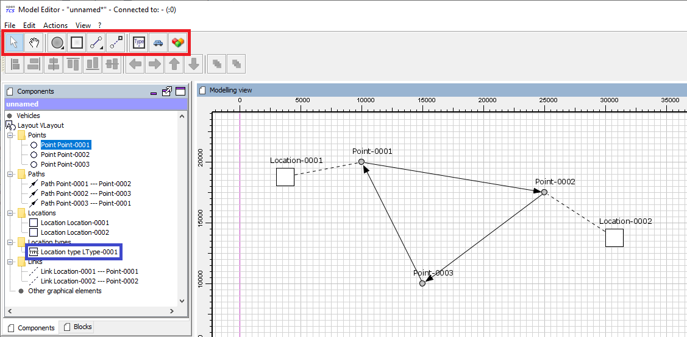
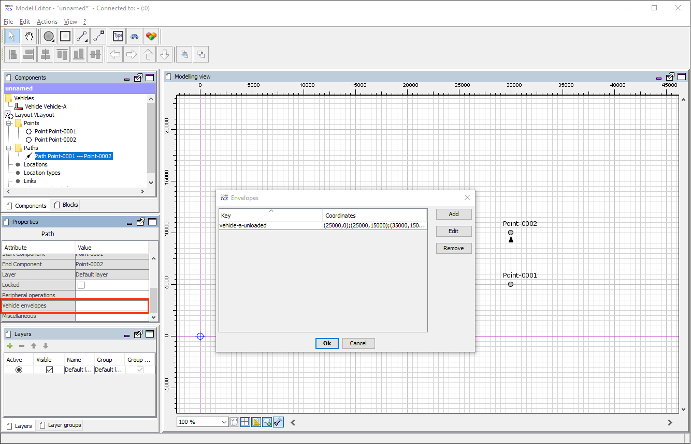
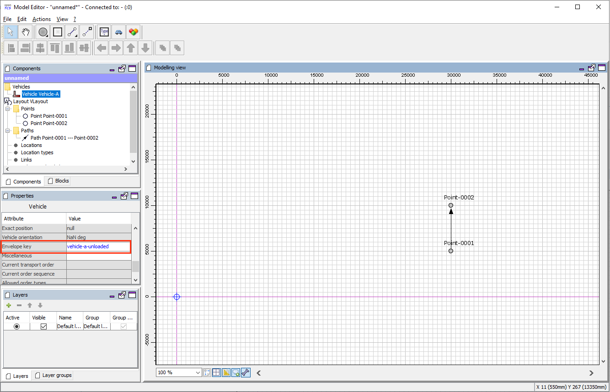
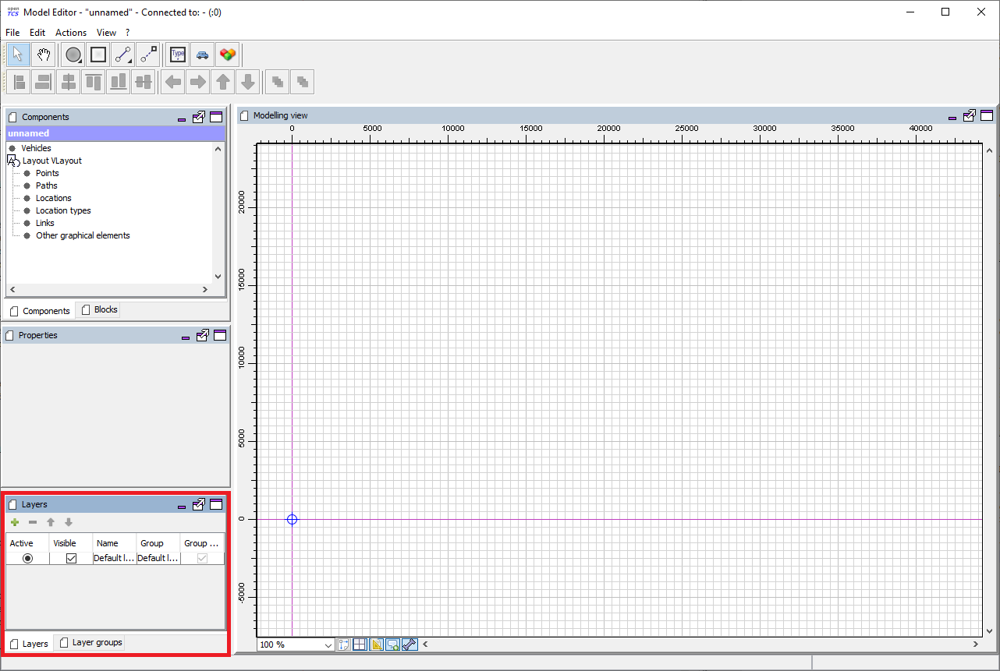
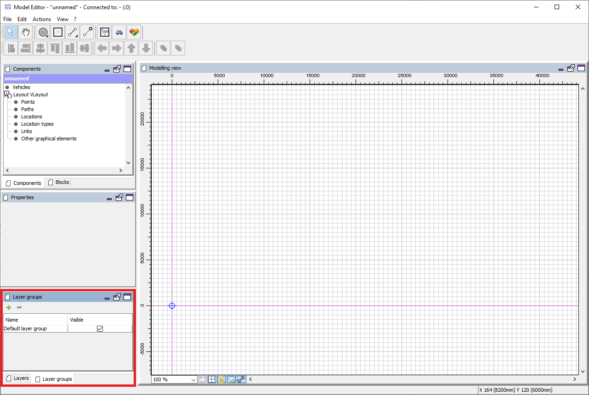
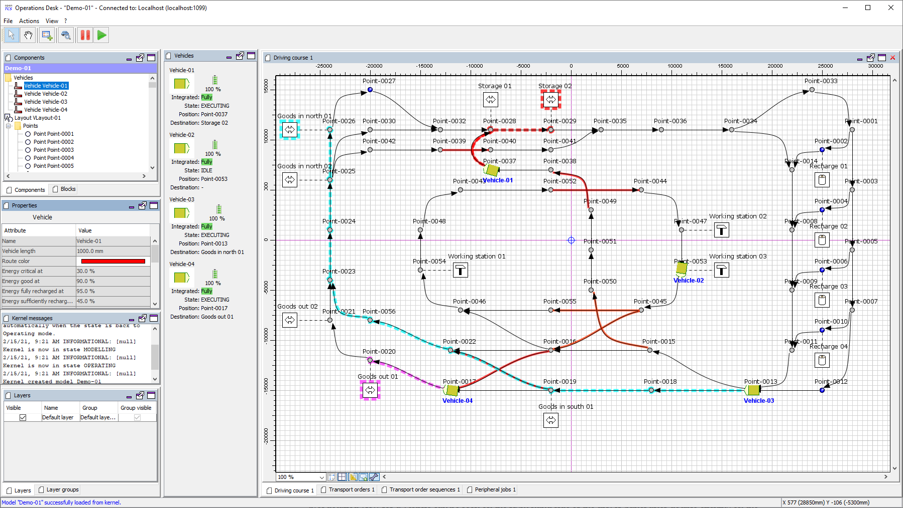
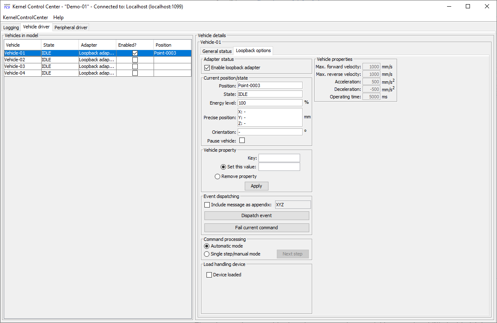
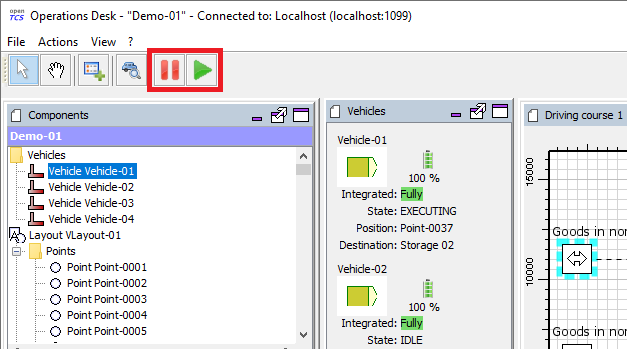

## 教程

要创建或编辑运输系统的工厂模型，请使用模型编辑器（Model Editor）应用程序。

作为基于现有工厂模型的运输控制系统的图形前端，请使用操作台（Operations Desk）应用程序。
请注意，操作台应用程序始终需要一个正在运行的 openTCS 内核以便连接。

启动应用程序是通过执行相应的 Unix shell 脚本（`\*.sh`）或 Windows 批处理文件（`*.bat`）来完成的。

### 构建新的工厂模型

这些说明演示了如何创建一个新的工厂模型并填充行驶路线元素，以便最终用于工厂运行。

#### 启动模型编辑器

1. 启动模型编辑器（`startModelEditor.bat/.sh`）。
1. 模型编辑器将启动一个新的空模型，但您也可以从文件（btn:[菜单:文件[加载模型]]）或当前内核模型（btn:[菜单:文件[加载当前内核模型]]）加载模型。
  后一种选项需要一个正在运行的内核，模型编辑器客户端可以连接到该内核。
1. 使用模型编辑器客户端的图形用户界面为您的相应应用程序/项目创建任意行驶路线。
  如何在您的行驶路线中添加点位、路径和车辆等元素将在下一节中详细解释。
  每当您想要重新开始，请从主菜单中选择 btn:[菜单:文件[新建模型]]。

#### 向工厂模型添加元素

.模型编辑器客户端中的控制元素

1. 通过从行驶路线元素工具栏中选择点位工具（见上图中的红色框），并在绘图区域点击三个位置，创建三个点位。
1. 通过以下方式将这三个点位与路径链接成一个闭环：
.. 从行驶路线元素工具栏中选择路径工具。
.. 点击一个点位，将路径拖动到下一个点位并在那里释放鼠标按钮。
1. 通过从行驶路线元素工具栏中选择位置工具，并在绘图区域的任意两个空闲位置上点击，创建两个位置。
  由于工厂模型中尚不存在位置类型，因此在创建第一个位置时会隐式创建一个新类型，这可以在绘图区域左侧的树视图中看到。
1. 通过以下方式将这两个位置与（不同的）点位链接起来：
.. 从行驶路线元素工具栏中选择链接工具。
.. 点击一个位置，将链接拖动到一个点位并释放鼠标按钮。
1. 通过点击行驶路线元素工具栏中的车辆按钮创建一辆新车。
1. 通过以下方式定义车辆在 newly created 位置允许的操作：
.. 在绘图区域左侧的树视图中选择位置的类型（见上图中的蓝色框）。
.. 点击树视图下方属性窗口中标记为 btn:[支持的车辆操作] 的值单元格。
.. 在显示的对话框中输入允许的任意文本作为操作，例如 `"装载货物"` 和 `"卸载货物"`。
.. 可选地，您可以通过编辑属性 `"符号"` 为选定类型的位置选择一个符号。

重要提示：除非您在工厂模型中创建位置，将这些位置链接到行驶路线中的点位，并定义车辆可以使用相应位置类型执行的操作，否则您将无法创建任何运输单并将其分配给车辆。

===== 添加和配置外设

如 工厂模型元素 所述，位置可用于映射外设。
这意味着，在执行上述步骤之后，工厂模型中现在有两个位置可用，这些位置可能用于集成两个外设。
要集成一个示例外设，需要执行以下额外步骤：

1. 通过将位置与外设关联：
.. 在绘图区域左侧的树视图中选择位置（例如上图中的 "Location-0001"）。
.. 点击树视图下方属性窗口中标记为 btn:[杂项] 的值单元格。
.. 添加一个键值对，键为 `tcs:loopbackPeripheral`，值为空。
1. 通过以下方式定义与该位置关联的外设允许的操作：
.. 在绘图区域左侧的树视图中选择位置的类型（例如上图中的 "LType-0001"）。
.. 点击树视图下方属性窗口中标记为 btn:[支持的外设操作] 的值单元格。
.. 在显示的对话框中输入允许的任意文本作为操作，例如 `"打开门"` 和 `"关闭门"`。
1. 可选地，通过在路径上定义外设操作：
.. 在绘图区域左侧的树视图中选择路径（例如上图中的 "Point-0001 --- Point-0002"）。
.. 点击树视图下方属性窗口中标记为 btn:[外设操作] 的值单元格。
.. 通过显示的对话框配置并添加外设操作。

注意：上述步骤描述了将位置与由回环外设驱动程序控制的外设关联的过程。
与不需要为回环车辆驱动程序分配进行任何额外配置的车辆不同，位置特别需要上述属性才能为其分配外设回环驱动程序。

重要提示：除非您在工厂模型中创建位置，将这些位置与外设关联，并定义外设可以使用相应位置类型执行的操作，否则您将无法创建任何外设任务并将其分配给外设。

#### 使用车辆包络线

如 工厂模型元素 所述，可以在点位和路径上定义车辆包络线。
车辆包络线是一系列顶点（即具有 x 和 y 坐标的点），当按定义的顺序连接时，代表车辆可能占据的区域。
除了顶点序列外，_包络线键_ 总是被分配给车辆包络线。
通过引用包络线键，车辆指示在分配资源时应考虑哪些包络线（可能在点位或路径上定义）。
（有关此方面的更多详细信息，请参阅 默认调度器。）
这样，就可以防止车辆分配与其他车辆已分配的相交区域。

注意：如果为车辆设置了包络线键，但在特定资源（即点位或路径）上没有定义具有相应键的包络线，则车辆在分配该资源时将不考虑任何包络线。

.为点位和路径定义和编辑车辆包络线

.为车辆设置包络线键

#### 使用图层和图层组

除了向工厂模型添加元素外，模型编辑器还允许创建具有不同图层和图层组的工厂模型。
有关图层和图层组属性的更多详细信息，请参阅 图层 和 图层组。

注意：在操作台应用程序中，只能显示/隐藏图层和图层组，而不能对其进行操作。

===== 图层

图层对点位、路径、位置和链接进行分组，并允许按需显示或隐藏其包含的行驶路线元素。
可以使用下图所示的面板创建、删除和编辑图层（见红色框）。
在使用图层时，有几点需要注意：

- 必须至少存在一个图层。
- 添加新图层时，它始终成为活动图层。
- 删除图层会导致其包含的行驶路线元素也被删除。
- 添加模型元素（即点位、路径等）时，它们始终放置在活动图层上。
- 链接（位置和点位之间）始终放置在与相应位置相同的图层上，无论活动图层是什么。
- 在对行驶路线元素执行“复制 & 粘贴”、“剪切 & 粘贴”或“重复”操作时，副本始终放置在活动图层上。

注意：在操作台应用程序中，图层的可见性也会影响是否在工厂模型中显示车辆元素。
车辆元素继承其报告所在点位的可见性。
如果车辆在属于隐藏图层（或图层组）的点位上报告，则该车辆元素不会在工厂模型中显示。

.图层面板（工具栏按钮：添加图层、删除（选中）图层、移动（选中）图层向上、移动（选中）图层向下）

===== 图层组

图层组顾名思义，对一个或多个图层进行分组，并允许同时显示或隐藏多个图层。
可以使用下图所示的面板创建、删除和编辑图层组（见红色框）。
在使用图层组时，有几点需要注意：

- 必须至少存在一个图层组。
- 删除图层组会导致分配给它的所有图层也被删除。

.图层组面板（工具栏按钮：添加图层组、删除（选中）图层组）

#### 保存工厂模型

您有两个选项来保存模型：保存在本地硬盘上，或保存在模型编辑器可以连接的正在运行的内核实例中。

===== 在本地保存模型

选择 btn:[菜单:文件[保存模型]] 或 btn:[菜单:文件[保存模型为...]] 并为模型输入文件名。

===== 将模型加载到正在运行的内核中

选择 btn:[菜单:文件[上传模型到内核]]，您的模型将被加载到内核中，使其可用于工厂操作。
不过，这需要您先将其保存到本地。
请注意，之前加载到内核中的任何模型都将被替换，因为内核一次只能存储一个模型。

### 操作工厂

这些说明解释了如何将新创建的加载到内核中的模型用于工厂操作，如何使用车辆驱动程序，以及如何创建运输单并由车辆处理。

#### 启动系统运行组件

.显示工厂模型的操作台应用程序

1. 启动内核（`startKernel.bat/.sh`）。
.. 如果这是您第一次运行内核，您需要先从模型编辑器中将现有的工厂模型加载到内核中。
（请参阅 将模型加载到正在运行的内核中）。
1. 启动内核控制中心应用程序（`startKernelControlCenter.bat/.sh`）
1. 启动操作台应用程序（`startOperationsDesk.bat/.sh`）
1. 在内核控制中心中，选择 btn:[车辆驱动程序] 选项卡。
然后为模型中的每辆车选择、配置并启动驱动程序。
.. 窗口左侧的列表显示了所选模型中的所有车辆。
.. 双击列表中的车辆名称后，可以在驱动程序面板右侧看到车辆的详细视图。
此详细视图的具体设计取决于与车辆关联的驱动程序。
通常，这里会显示由车辆发送的状态信息（例如当前位置和操作模式），并提供低级设置（例如车辆 IP 地址）。
.. 右键单击车辆列表会显示一个弹出菜单，允许将驱动程序附加到选定的车辆。
.. 要使车辆能够被系统控制，需要将驱动程序附加到车辆并启用。
（为了在没有可以与系统通信的真实车辆的情况下进行测试，可以使用所谓的回环驱动程序，它提供一个大致模拟真实车辆的虚拟车辆。）
有关如何附加和启用车辆驱动程序的详细说明，请参阅 配置车辆驱动程序。

.带有车辆详细视图的驱动程序面板

#### 配置车辆驱动程序

1. 切换到内核控制中心应用程序。
1. 通过将车辆与回环驱动程序关联：右键单击驱动程序面板车辆列表中的车辆，并选择菜单项 btn:[菜单:驱动程序[回环适配器（虚拟车辆）]]。
1. 通过双击列表中的车辆名称打开车辆的详细视图。
1. 在现在显示在车辆列表右侧的车辆详细视图中，选择 btn:[回环选项] 选项卡。
1. 通过勾选 btn:[回环选项] 选项卡中的 btn:[启用回环适配器] 复选框或车辆列表中 btn:[启用？] 列中的复选框来启用驱动程序。
1. 在 btn:[回环选项] 选项卡或车辆列表中，从工厂模型中选择一个点位，以便回环适配器将该点位报告给内核作为（虚拟）车辆的当前位置。
  在 btn:[回环选项] 选项卡中，可以通过点击 btn:[位置] 文本来完成此操作。
  （在实际应用中，与真实车辆通信的车辆驱动程序一旦知道车辆位置，就会自动将该位置报告给内核。）
1. 切换到操作台客户端。
  现在应该在您使用回环驱动程序放置它的点位上显示代表车辆的图标。
1. 右键单击车辆并选择 btn:[菜单:上下文菜单[更改集成级别 > ...以利用此车辆处理运输单]]，以允许内核调度该车辆。
  然后该车辆可用于处理订单，这在操作台应用程序窗口左下角的属性面板中以集成级别 `TO_BE_UTILIZED` 表示。
  （您可以通过右键单击车辆并选择 btn:[菜单:上下文菜单[更改集成级别 > ...以尊重此车辆的位置]] 来撤销此操作。
  现在显示的集成级别是 `TO_BE_RESPECTED`，并且车辆将不再被调度处理运输单。）

#### 创建运输单

要创建运输单，操作台应用程序提供了一个对话框窗口，当从菜单中选择 btn:[菜单:操作[创建运输单...]] 时显示。
运输单定义为一系列目的地位置，车辆在处理该订单时应在这些位置执行操作。
您可以从下拉菜单中选择目的地位置和操作。
您还可以选择 intended 处理此订单的车辆。
如果没有明确选择，控制系统将根据其内部可配置的策略自动将订单分配给车辆（请参阅 默认调度器配置条目）。
您还可以选择或定义要创建的运输单的类型。
此外，可以为运输单指定截止时间，指定最晚完成订单的时间点。
当池中有多个运输单且 openTCS 需要决定下一个分配哪个时，主要考虑此截止时间。

要创建新的运输单，请执行以下操作：

1. 选择菜单项 btn:[菜单:操作[创建运输单...]]。
1. 在显示的对话框中，点击 btn:[添加] 按钮，选择位置作为目的地，并选择车辆应在那里执行的操作。
  您可以通过这种方式为订单添加任意数量的目的地。
  它们将按照给定的顺序进行处理。
1. 通过点击 btn:[确定] 创建具有给定目的地的运输单后，内核将寻找可以处理该订单的车辆。
  如果找到车辆，它将立即被分配该订单，并且为其计算的路径将在操作台应用程序中高亮显示。
  然后回环驱动程序模拟车辆移动到目的地并执行操作。

#### 使用操作台应用程序撤回运输单

可以从正在处理运输单的车辆中撤回运输单。
撤回运输单时，其处理将被取消，车辆（驱动程序）将不再收到任何进一步的移动命令。
可以通过在操作台应用程序中右键单击相应的车辆，选择 btn:[菜单:上下文菜单[撤回运输单]]，然后选择以下操作之一来发出撤回：

- '...并让车辆完成移动'：
  车辆将处理它已经收到的任何移动命令，并在处理后停止。
  这种类型的撤回应通常用于从车辆中撤回运输单。
- '...并立即停止车辆'：
  除了常规撤回发生的情况外，还会要求车辆丢弃它已经收到的所有移动命令。
  （这 _应该_ 使它在大多数情况下很快停下来。
  然而，它究竟还会移动多远完全取决于车辆的类型、其当前状况以及 openTCS 与此类车辆之间的通信方式。）
  此外，除车辆当前报告的位置外，撤回路线上所有资源的预留（即接下来的路径和点位）都被取消，使这些资源可供其他车辆使用。
  这种强制撤回应非常小心地使用，通常仅在车辆当前 _未移动_ 时使用！

警告：由于强制撤回释放了之前为该车辆保留的路径和点位，其他车辆可能会在撤回后立即获取并使用这些资源。
同时，如果在发出撤回时车辆正在移动，它可能 - 取决于其类型 - 尚未停止，并且仍沿其先前被命令遵循的路线移动。
由于后一种运动不受 openTCS 协调，这可能导致车辆之间的 _碰撞或死锁_！
因此，强烈建议仅在必要时才发出强制撤回，并且仅在车辆已经在行驶路线中的某个位置停止或其他车辆无需考虑的情况下。
在所有其他情况下，应使用常规撤回。

撤回的运输单的处理 _不能_ 稍后恢复。
要恢复因撤回运输单而中断的运输过程，您需要创建一个新的运输单，当然，它可以包含与撤回的运输单相同的目的地。
但是，请注意，新运输单不能使用相同的名称创建。
原因是：

a. 运输单的名称必须是唯一的。
b. 撤回运输单仅中止其处理，但并未立即从内核内存中移除它。
   运输单数据会作为历史信息保留一段时间，然后才被完全移除。
   （旧订单保留多长时间取决于内核应用程序的配置 -- 请参阅 订单池配置条目。）

因此，用于运输单的名称最终可能会被重用，但只有在旧订单的实际数据被移除之后。

#### 连续创建运输单

注意：操作台应用程序可以通过自定义插件轻松扩展。
作为参考，包含一个简单的负载生成器插件，此处也用作系统运行期间外观的演示。
有关如何创建自定义插件并将其集成到操作台应用程序中的详细信息，请参阅开发者指南。

1. 在操作台应用程序中，从菜单中选择 btn:[菜单:视图[插件 > 连续负载]]。
1. 选择创建新运输单的触发器：
  新订单要么只创建一次，要么当系统中未处理的订单数量低于指定限制时创建，要么在指定超时过期后创建。
1. 通过使用订单配置文件，您可以决定运输单的目的地是否应随机选择，或者您是否想自己选择。
+
使用 btn:[随机创建订单]，您定义每次生成的运输单数量，以及单个运输单应包含的目的地数量。
由于目的地将随机选择，创建的订单对于真实系统来说不一定有意义。
+
使用 btn:[根据定义创建订单]，您可以定义任意数量的运输单，每个运输单具有任意数量的目的地和属性，并保存和加载您的运输单列表。
1. 通过激活 btn:[连续负载] 面板底部的相应复选框来启动订单生成器。
  然后负载生成器将根据其配置生成运输单，直到复选框被停用或面板关闭。

#### 配置外设驱动程序

注意：为了执行以下步骤，请确保首先按照 添加和配置外设 所述将位置与外设关联。

1. 切换到内核控制中心应用程序。
1. 选择 btn:[外设驱动程序] 选项卡。
  - _应该已经将位置与外设回环驱动程序关联。_
1. 通过双击列表中外设的名称打开位置的详细视图。
1. 在现在显示在外设列表右侧的位置详细视图中，选择 btn:[回环选项] 选项卡。
1. 通过勾选外设列表中 btn:[启用？] 列中的复选框来启用驱动程序。
1. 切换到操作台客户端。
1. 现在该外设可用于处理外设任务。

#### 创建外设任务

外设任务定义为由处理该任务的外设执行的单个操作。
外设任务可以显式或隐式创建；以下部分描述了这两种方式。

注意：有关如何将外设任务分配给外设的信息，请参阅 默认外设任务调度器。
有关如何配置控制系统内部用于分配外设任务的策略的信息，请参阅 默认外设任务调度器配置条目。

===== 显式创建外设任务

要在操作台应用程序中创建新的外设任务，请执行以下操作：

1. 选择菜单项 btn:[菜单:操作[创建外设任务...]]。
1. 在显示的对话框中，选择与应分配外设任务的外设关联的位置，以及外设应执行的操作。
  此外，为预留令牌输入一些任意文本。
  （目前，预留令牌并不重要。
  唯一重要的是它不为空。
  有关预留令牌的更多详细信息，请参阅 默认外设任务调度器。）
1. 通过点击 btn:[确定] 创建外设任务后，内核将尝试将其分配给与给定位置关联的外设以处理该任务。
  一旦分配了外设任务，回环驱动程序就模拟外设执行操作。

注意：虽然使用此选项创建外设任务是可以的，但下一个选项是首选选项，因为它允许车辆和外设之间的直接交互。

===== 隐式创建外设任务

注意：为了使隐式创建外设任务正常工作，请确保首先按照 添加和配置外设 所述在路径上定义外设操作。

车辆可以在遍历定义了外设操作的路径时隐式创建外设任务。
何时为路径上定义的外设操作创建外设任务取决于外设操作本身的配置。
如 外设操作 所述，外设操作的 _执行触发器_ 定义了何时应由外设执行该操作。
请注意关于属于外设操作的外设任务的创建时间：

- `AFTER_ALLOCATION`（以前称为 `BEFORE_MOVEMENT`）：一旦为车辆分配了对应路径的资源，就创建外设任务。
  这意味着如果车辆可以提前接受多个（点位和）路径，则在车辆甚至到达实际路径之前就可能创建外设任务。
- `AFTER_MOVEMENT`：一旦车辆完全遍历路径并将相应的移动命令报告为已执行（即车辆到达路径的相应终点），就创建外设任务。

#### 使用操作台应用程序撤回外设任务

如何撤回外设任务取决于它是否与运输单相关：

- 与运输单无关的外设任务以及与处于最终状态（已完成或失败）的运输单相关的外设任务，可以通过在外设任务表中选择它们并点击表上方显示的撤回按钮来撤回。
- 与运输单相关的外设任务将在 respective 运输单被撤回时隐式中止。
  不支持独立于相关运输单撤回它们（除非相关运输单已经处于最终状态 -- 见上文。）
  - 对于常规撤回的运输单，相关的外设任务在车辆完成其待处理移动后中止。
  - 对于强制撤回的运输单，相关的外设任务立即中止。

===== 外设任务失败的后果

当外设任务失败时，相关的运输单（如果有）在以下情况下会被隐式撤回：

- 外设任务是由车辆遍历路径隐式创建的（请参阅 隐式创建外设任务）。
- 外设任务的外设操作的 _完成必需_ 标志设置为 `true`。

在这种情况下，继续运输单是不合理的，因为 _完成必需_ 标志不仅表明车辆应等待外设操作完成，而且还要等待其 _成功_ 完成。
否则，继续驾驶/运输单的前提条件可能不满足。

#### 从运行中的系统中移除车辆

在某些情况下，您可能希望从系统中移除单个车辆，例如，因为车辆暂时无法被 openTCS 使用，由于必须先处理的硬件故障。
以下步骤将确保没有进一步的运输单分配给车辆，并且它可能仍然占用的资源被释放供其他车辆使用。

1. 在操作台应用程序中，右键单击车辆并选择 btn:[菜单:上下文菜单[更改集成级别 > ...以忽略此车辆]]，以禁用车辆处理运输单并释放车辆占用的行驶路线中的点位。
1. 在内核控制中心应用程序中，通过取消勾选 btn:[回环选项] 选项卡中的 btn:[启用回环适配器] 复选框或车辆列表中 btn:[启用？] 列中的复选框来禁用车辆的驱动程序。

#### 暂停和恢复车辆操作

操作台应用程序提供了两个按钮，可以暂停或恢复车辆的操作。
但是，为了使这些按钮生效，所用车辆的相应车辆驱动程序必须实现并支持此功能。

.操作台应用程序中的暂停和恢复按钮
